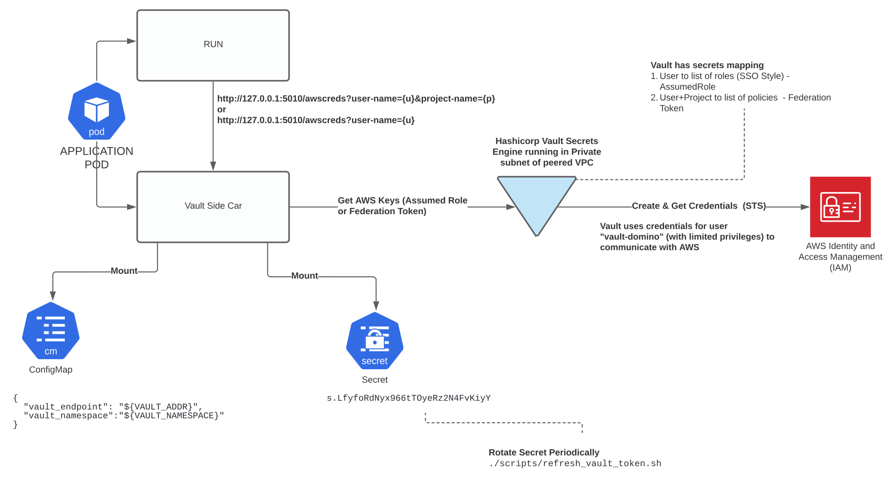

## High Level Architecture

The high level design for dynamic credential generation is depicted in the diagram below:

1. [Domsed](https://github.com/cerebrotech/domsed) is used to inject a side-car in the App Pod.
2. The side-car is a Flask App which exposes two endpoints to the `run` container to fetch temporary aws credentials dynamically   
3. The injected side-car communicates with Hashicorp Vault instance using a token mounted as a secret. 
4. Vault communicates with AWS using a AWS service account with limited privileges to generate credentials using STS but limited by permission boundaries

In document below we will demonstrate the following:

1. Install Vault locally and run the side-car as a stand-alone Flask App
2. Demonstrate the `run` container functionality by generating credentials via the side-car
3. Extending the design to a central version of Vault used by a Domino Installation

## Use-Case
The use-case this solution addresses is as follows:

1. Domino has 3 users namely, `test-user-1`,`test-user-2` and  `test-user-3`
2. The customer is named `domino-demo-customer`
3. In the customer AWS account is a bucket creatively named as `domino-demo-customer-bucket`
4. The bucket has the following key/value pairs
   - `test-user-1/whoami.txt` = `I am test-user-1`
   - `test-user-2/whoami.txt` = `I am test-user-2`
   - `test-user-3/whoami.txt` = `I am test-user-3`
5. All users have access to their own sub-folders
6. Users can be provided access to other users sub-folders

## Local Installation and Testing

In this section we will prepare the foundation for adding Credential Propagation to Domino Apps
The overall Vault [Getting  Started tutorial](https://learn.hashicorp.com/collections/vault/getting-started) is a good place to get started with understanding how to use Vault.

### Installation of Vault 
1. First [install](https://learn.hashicorp.com/tutorials/vault/getting-started-install?in=vault/getting-started) Vault locally
2. [Start](https://learn.hashicorp.com/tutorials/vault/getting-started-dev-server?in=vault/getting-started) Vault in Dev mode.
   The command to run on your localhost terminal is `vault server -dev`
   In the output note the following. You will need all three (Examples shown below)   
   - `export VAULT_ADDR=http://127.0.0.1:8200`
   - `Unseal Key: G+5edKxySWwPydj8BB3mUBiJxUamo1pKequX5DS26kY=`
   - `Unseal Key: G+5edKxySWwPydj8BB3mUBiJxUamo1pKequX5DS26kY=`
     `Root Token:  s.mJTaOPfOLMyECRnilupJNSPb`
     
   Ensure that you protect the root token and the unseal key. Write to your AWS Secrets Engine in AWS
   
3. Go to your browser and login to `http://127.0.0.1:8200` using the root token.
4. Configure the following environment variables
   ```shell
   export VAULT_ADDR=http://127.0.0.1:8200
   export VAULT_TOKEN=s.mJTaOPfOLMyECRnilupJNSPb #Your token will be different
   # export VAULT_NS=domino/my_install #Namespaces are an enterprise feature.You don't need this in Open Source Version
   ```

## Quick Install

Once Vault is installed add the following environment variables and run `./install.sh`
```
export VAULT_ADDR=http://127.0.0.1:8200 #Replace with your own url for remote vault
export VAULT_TOKEN="ADD HERE"
export VAULT_NS="" #Add your own namespace. Only valid for enterprise version. If so replace with export VAULT_NS="dominoaws" o
export docker_version=beta_v3 #Add the side-car to a docker registry with a tag
./scripts/install.sh $docker_version
```

## What happens in the quick install
Internally the `./scripts/install.sh $docker_version` performs the following steps

### Create the bucket

We will create this bucket and its contents by invoking the following program

```
    python ./src/admin/create_demo_customer_bucket.py <CONFIG_FILE_NAME> <AD_MAPPING_FILE>
    #Ex. python ./src/admin/create_demo_customer_bucket.py ./config/install_config.json ./config/user_names.json
    #Invoking the below has the same effect because those paths are defaults
    python ./src/admin/create_demo_customer_bucket.py 
```
The `./config/install_config.json` contains the aws iam user vault will use as well as the demo-bucket name
```json
{
  "domino_vault_user" : "vault-domino",
  "customer_s3_bucket" : "domino-test-customer-bucket"
}
```

Think of the file `./config/users.json` to be auto-generated by listing the AD roles mapped to AWS roles. It
is a mapping of users to each AWS role they are mapped through via AWS SAML Integration with LDAP/AD

### Create the IAM User to be used by Vault
Next create an IAM user whose permissions vault will assume to make STS calls

```
python ./src/admin/configure_vault_aws_user.py <domino_vault_user> <customer_s3_bucket>
```
Default values are:
```
domino_vault_user = vault-domino
customer_s3_bucket = domino-demo-customer-bucket
```
This call will place a file `$PROJECT_ROOT/aws_creds/creds.json` which will contain the 
aws credentials of the new user. This allows the above command to be invoked without the 
third parameter as long as the file is present as  `./aws_creds/creds.json`

This user will assume the following permissions:
1. `./aws_policy_templates/VAULT_USER_POLICY_TEMPLATE.json` with name `VAULT_DOMINO_USER`
2. `./aws_policy_templates/PERMISSIONS_BOUNDARY_POLICY_TEMPLATE.json` with name `CUSTOMER_BOUNDARY_PERMISSION`

The latter policy allows the `vault-domino` user full permissions to the bucket `domino-demo-customer-bucket`

The access keys are placed in the file `./aws_creds/creds.json`

### Create roles in AWS to enable write access to each sub-folder of the bucket

To create a list of demo roles and policies review the file `./config/users.json`
```json
{
  "AD_GROUPS": ["GRP-1","GRP-2","GRP-3"],
  "AWS_ROLES":  ["sample_domino_customer_role_1","sample_domino_customer_role_2","sample_domino_customer_role_3"],
  "AWS_ROLES_TO_POLICIES_MAPPING": {
    "sample_domino_customer_role_1": ["vault_test-user-1_policy","vault_test-user-2_policy"],
    "sample_domino_customer_role_2": ["vault_test-user-2_policy"],
    "sample_domino_customer_role_3": ["vault_test-user-3_policy"]
  },
  "AD_GROUP_TO_AWS_ROLE_MAPPING": {"GRP-1": "sample_domino_customer_role_1",
                                   "GRP-2": "sample_domino_customer_role_2",
                                   "GRP-3": "sample_domino_customer_role_3"},
  "AD_GROUP_TO_USER_MAPPING": {"GRP-1": ["test-user-1","test-user-2"],
                               "GRP-2": ["test-user-2"],
                               "GRP-3": ["test-user-3"]}
}
```
We have the following relationship between AD Group/Roles and Users in the above JSON file

| AD Group      | AWS Role       | AD Members
|--------------|-----------------|--------------
|GRP-1   |sample_domino_customer_role_1  |test-user-1
|    | |test-user-2
GRP-1  |sample_domino_customer_role_2|test-user-2
GRP-1   |sample_domino_customer_role_3|test-user-3

To create the necessary policies and roles mapped to user (SSO Emulation) run the following command
```shell
python ./src/admin/configure_ldap_based_aws_policies_and_roles.py.py
```


- Customer has Active Directory (AD) groups `AD_GROUPS`. User's in AD are mapped to an AD group based on `AD_GROUP_TO_USER_MAPPING`
- Imagine the customer has mapped two AD Groups (`AD_GROUPS`) to two AWS Roles (`AWS_ROLES`)
- AD Group is mapped to AWS Role in a one to one mapping based on `AD_GROUP_TO_AWS_ROLE_MAPPING`
- Each of those roles is mapped to one or more policies based on `AWS_ROLES_TO_POLICIES_MAPPING`

This file can be auto-generated based on querying Active Directory. All except `AWS_ROLES_TO_POLICIES_MAPPING` are needed to automate 
the process. `AWS_ROLES_TO_POLICIES_MAPPING` is something that happens outside of this solution as part of Role Governance.


### Configure Vault for Domino App's Cred Prop

Note that the following env variables are configured:
`VAULT_ADDR`
`VAULT_TOKEN`
 

Copy the Access and Secret keys and configure these env variables and run the command `./scripts/configure-vault.sh`
```shell
export AWS_ACCESS_KEY_ID=$(cat ./aws_creds/creds.json | jq -r '.AccessKeyId')
export AWS_SECRET_ACCESS_KEY=$(cat ./aws_creds/creds.json | jq -r '.SecretAccessKey')
./scripts/configure-vault.sh
```
This achieves the following:

1. Generate an APP TOKEN which allows Domino to communicate with Vault. You need the `VAULT_ADDR` and `VAULT_TOKEN` variables set at this point
   We will use this as the vault token from this point on to communicate
   ```shell
   
   # First define the policy (access permissions) for the token we are about to generate
   # This defines the permission boundaries for the vault token
   
   vault policy write domino ./vault_policies/domino.hcl
   
   #Make the token valid for 25 hours and renew every 24 hours. This is necessary
   #because a token can be renewable for upto 768 hours but always expires in 24 hours
   
   export VAULT_TOKEN=$(vault token create -orphan -policy=domino -period=25h  -ttl 25h -format=json | jq .auth.client_token | sed 's/"//g' )
  
   #Write to a file (Or your AWS Secrets Engine) Securing is important. Token gives access to vault
   echo $VAULT_TOKEN > ./root/etc/vault/token
   ```
2. Enable the AWS Secrets Engine in Vault
   ```shell
   #There are many more (https://www.vaultproject.io/docs/secrets)
   vault secrets enable aws
   ```
3. Vault generates AWS credentials by requesting AWS STS for these credentials. The user `vault-domino` was 
   created with the appropriate permissions to generate "AssumeRole", "GetFederationToken" privileges.
   We now configure Vault with the keys of this user to perform the actions on Domino's behalf.
   ```shell
   vault write aws/config/root \
       access_key=$AWS_ACCESS_KEY_ID \
       secret_key=$AWS_SECRET_ACCESS_KEY \
       region=us-west-2
   ```
4. Immediately rotate them. This ensures that now only Vault knows the SecretAccessKey
   ```shell
      #Immediately rotate them. Now only vault knows the secret key. The existing ones are replaced
      vault write -f aws/config/rotate-root
   ```

### Configure the k8s cluster
First install Domsed and execute the command
```shell
./scripts/install-vault-cred-prop-to-domino.sh $docker_version
```
This performs the following steps:

1. Write token to a k8s secret (Step only makes sense when Vault is not deployed in local mode)
   ```shell
      export compute_namespace=domino-compute
      kubectl delete secret vault-token -n $compute_namespace
      kubectl create secret generic vault-token --from-literal=token=$VAULT_TOKEN -n $compute_namespace
   ```
2. Create a k8s config-map to provide connection details to Vault (Step only makes sense when Vault is not deployed in local mode)
   ```
      export compute_namespace=domino-compute
      export DOMSED_VAULT_CONFIGMAP_NAME=dynamic-aws-creds-config
      kubectl delete configmap ${DOMSED_VAULT_CONFIGMAP_NAME} -n $compute_namespace
      cat <<EOF | kubectl create -n ${compute_namespace} -f -
      apiVersion: v1
      kind: ConfigMap
      metadata:
        name: ${DOMSED_VAULT_CONFIGMAP_NAME}
      data:
        dynamic-aws-creds-config: |-
          {
            "vault_endpoint": "${VAULT_ADDR}",
            "polling_interval_in_seconds" : 300,
            "refresh_threshold_in_seconds" : 600,
            "vault_namespace" : "${VAULT_NAMESPACE}",
            "lease_increment" : 3600,
            "default_user" : "default"
          }
      EOF
   ```
2. Deploy the Domsed Mutation to inject the Vault Side Car
   ```shell
   #Deploy the DOMSED Mutation to perform AWS Credential Propagation using Dynamic Secrets
   kubectl delete -f ./mutations/dynamic-vault-based-creds-mutation.yaml -n $platform_namespace
   kubectl create -f ./mutations/dynamic-vault-based-creds-mutation.yaml -n $platform_namespace
   ```

### Define access control by calling user and project (Federated User)

We can also provide access control by {DOMINO-PROJECT-OWNER}-{DOMINO-PROJECT}-{CALLING-DOMINO-USER}

For this type of control we use "Federation Token". The sample file is located in `./config/vault_role_by_project_and_user.json`
```json
{
  "users_by_project": {
    "test-user-1-quick-start": {
      "test-user-1": {
        "policies": [
          "vault-test-user-1_policy",
          "vault-test-user-2_policy"
        ]
      },
      "test-user-2": {
        "policies": [
          "vault-test-user-2_policy"
        ]
      },
      "test-user-3": {
        "policies": [
          "vault-test-user-3_policy"
        ]
      }
    },
    "test-user-2-quick-start": {
      "test-user-2": {
        "policies": [
          "vault-test-user-2_policy"
        ]
      },
      "test-user-3": {
        "policies": [
          "vault-test-user-3_policy"
        ]
      }
    },
    "test-user-3-quick-start": {
      "test-user-1": {
        "policies": [
          "vault-test-user-1_policy"
        ]
      },
      "test-user-3": {
        "policies": [
          "vault-test-user-3_policy"
        ]
      }
    }
  }
}


```

We have the following projects, owner, collaborators and policy relationship in the above file:

| Project      | Owner       | Collaborators|Policies
|--------------|-------------|--------------|--------
|quick-start   |test-user-1  |test-user-1|vault-test-user-1_policy, vault-test-user-2_policy
|    | |test-user-2|vault-test-user-2_policy
|    | |test-user-3|vault-test-user-3_policy
|quick-start   |test-user-2|test-user-2|vault-test-user-2_policy
|    | |test-user-3|vault-test-user-3_policy
|quick-start   |test-user-3|test-user-3|vault-test-user-3_policy
|    | |test-user-1|vault-test-user-1_policy


### Map roles to users in Vault
Now we need to configure roles inside Vault which will be configured to do one of the following on behalf of the caller :

1. AssumeRole - The naming convention is `vault-{DOMINO_USER_NAME}`
   This type of Vault Role will be attached to a list of `role_arns`
2. FederatedUser - The naming convention is `vault-{DOMINO_PROJECT_OWNER}-{DOMINO_PROJECT_NAME}-{DOMINO_USER_NAME}`
   This type of Vault Role will be attached to a list of `policy_arns` or `iam_groups`

The idea behind the two approaches is -

1. AssumeRole - Is similar to federated user. User will get a set of AWS credentials for the roles (AD Groups) they are mapped to and the applicaion will need to pick one for a task at hand
   ```json
   {
    "credential_type": "assumed_role",
    "role_arns": ["arn:aws:iam::xxx:role/sample_domino_customer_role_1","arn:aws:iam::xxx:role/sample_domino_customer_role_2"]
   }
   ```
2. FederatedUser - This is a single AWS Credential with permission set equal to all policies attached. The idea is to provide access to user for a project.
   ```json
   {
       "credential_type": "federation_token",
       "policy_arns": ["arn:aws:iam::xxx:policy/vault_test-user-1_policy","arn:aws:iam::xxx:policy/vault_test-user-2_policy"]
   }
   ```
The App using these will know which one is used depending on how it retrieves the credentials.

1. AssumeRole - [http://127.0.0.1:5010?user-name=test-user-1](http://127.0.0.1:5010?user-name=test-user-1)
   Get me AWS Credentials for the calling user indexed by role arn.
2. FederatedUser - [user-name=test-user-1&project-name=test-user-2-quick-start](user-name=test-user-1&project-name=test-user-2-quick-start)
   Get me AWS Credentials indexed by Project-Owner+Project-Name-Calling-User-Name


To generate test roles and policies run the following command:
```shell
  python src/admin/configure_vault_aws_roles.py
```

## Test the Side-Car and App Function Locally

### Start the Side-Car Locally
To start the side-car locally run the following command 
```shell
  python src/mutation/app_vault_sidecar.py ./rootlocal 5010
```

In your APP pod, the same Flask App will run on port 5010. Details of the mutation are in the file
`./mutations/app_cloud_creds_mutation.yaml`

```yaml

apiVersion: apps.dominodatalab.com/v1alpha1
kind: Mutation
metadata:
  name: app-cloud-creds-mutation
rules:
  - # Optional. List of hardware tier ids
    #hardwareTierIdSelector: []
    # Optional. List of organization names
    #organizationSelector: []
    # Optional. List of user names
    # Insert volume mount into specific containers
    labelSelectors:
    - "dominodatalab.com/workload-type=App"
    # Insert arbitrary container into matching Pod.
    insertContainer:
      # 'app' or 'init'
      containerType: app
      # List of label selectors.
      # ALL must match.
      # Supportes equality and set-based matching
      # Arbitrary object
      spec:
        name: z-vault-cloud-creds
        image: quay.io/domino/app-cloud-creds:beta_v0
        args: ['/','5010' ]
        volumeMounts:
          - name: log-volume
            mountPath: /etc/log/
          - mountPath: /etc/vault/
            name: token
          - name: dynamic-aws-creds-config
            mountPath: /etc/config/
            readOnly: true
    insertVolumes:
      - emptyDir: { }
        name: log-volume
      - name: token
        secret:
          secretName: vault-token
      - name: dynamic-aws-creds-config
        configMap:
          name: dynamic-aws-creds-config


```
### Start the App Emulator Locally

Now let us emulate the app with another flask app which runs on port 5100

```shell
python src/mutation/app-test.py ./rootlocal
```


#### Locally Test User Level Access
To test how access is permitted for a user invoke the following. This is an `AssumeRole` operation
and derives its credentials per role attached to the AD user based on their group membership

```shell
curl --location --request GET 'http://127.0.0.1:5100/readS3ByUserLevelAccessControl' \
--header 'X-Script-Name: /test-user-1/quick-start/anything/random' \
--header 'Domino-Username: test-user-1'
```


We are invoking the app for project `quick-start` owned by user `test-user-1` by user `test-user-1`

To emulate the same APP invocation as `test-user-2` run the following command
```shell
curl --location --request GET 'http://127.0.0.1:5100/readS3ByUserLevelAccessControl' \
--header 'X-Script-Name: /test-user-1/quick-start/anything/random' \
--header 'Domino-Username: test-user-2'
```

First you need to get all the AWS roles attached to this user. This is obtained by making the call to the side-car
```shell
curl --location --request GET 'http://127.0.0.1:8200/v1/aws/roles/vault-test-user-2' \
--header 'X-Vault-Token: s.1XGbhTykFJFUJDl4ZS5V8oXy' 
```
The resulting output shows that the user is attached to two roles-

- arn:aws:iam::<AWS_ACCOUNT_NO>:role/vault-sample_domino_customer_role_1
- arn:aws:iam::<AWS_ACCOUNT_NO>:role/vault-sample_domino_customer_role_2
```json
{
    "request_id": "ce44c8de-8b8e-3006-deba-e0c783a36630",
    "lease_id": "",
    "renewable": false,
    "lease_duration": 0,
    "data": {
        "credential_type": "assumed_role",
        "default_sts_ttl": 0,
        "iam_groups": null,
        "iam_tags": null,
        "max_sts_ttl": 0,
        "permissions_boundary_arn": "",
        "policy_arns": null,
        "policy_document": "",
        "role_arns": [
            "arn:aws:iam::<AWS_ACCOUNT_NO>:role/vault-sample_domino_customer_role_1",
            "arn:aws:iam::<AWS_ACCOUNT_NO>:role/vault-sample_domino_customer_role_2"
        ],
        "user_path": ""
    },
    "wrap_info": null,
    "warnings": null,
    "auth": null
}
```

The output of the command below will test access control on all the buckets for each of those roles 
separately. This is similar to Credential Propagation where you have to pick a profile for the credentials you are using.
The permissions are not a "UNION" of the roles attached. 


```shell
curl --location --request GET 'http://127.0.0.1:8200/v1/aws/roles/vault-test-user-2' \
--header 'X-Vault-Token: s.1XGbhTykFJFUJDl4ZS5V8oXy' 
```
```json
{
    "arn:aws:iam::<AWS_ACCOUNT_NO>:role/vault-sample_domino_customer_role_1": [
        {
            "bucket": "domino-test-customer-bucket",
            "key": "test-user-1/whoami.txt",
            "value": "I am test-user-1"
        },
        {
            "bucket": "domino-test-customer-bucket",
            "key": "test-user-2/whoami.txt",
            "value": "I am test-user-2"
        },
        {
            "bucket": "domino-test-customer-bucket",
            "key": "test-user-3/whoami.txt",
            "value": "An error occurred (AccessDenied) when calling the GetObject operation: Access Denied"
        }
    ],
    "arn:aws:iam::<AWS_ACCOUNT_NO>:role/vault-sample_domino_customer_role_2": [
        {
            "bucket": "domino-test-customer-bucket",
            "key": "test-user-1/whoami.txt",
            "value": "An error occurred (AccessDenied) when calling the GetObject operation: Access Denied"
        },
        {
            "bucket": "domino-test-customer-bucket",
            "key": "test-user-2/whoami.txt",
            "value": "I am test-user-2"
        },
        {
            "bucket": "domino-test-customer-bucket",
            "key": "test-user-3/whoami.txt",
            "value": "An error occurred (AccessDenied) when calling the GetObject operation: Access Denied"
        }
    ]
}
```

All aws credentials have a time to live (TTL) for 60 mins. And will be cached for 60 mins
They will be refreshed if will be valid for less than 10 mins.

To refresh the cache immediately, you need to pass another header parameter `Creds-Refresh` as True
```shell
curl --location --request GET 'http://127.0.0.1:5100/reads3byusr' \
--header 'X-Script-Name: /test-user-1/quick-start/anything/random' \
--header 'Domino-Username: test-user-2'
--header 'Creds-Refresh: True'
```

#### Locally Test By Project and User Level Access

Run the following curl command
```shell
curl --location --request GET 'http://127.0.0.1:5100/reads3byprjusr' \
--header 'X-Script-Name: /test-user-1/quick-start/rrr/rrr' \
--header 'Domino-Username: test-user-1'
```

This will generated a FEDERATED_USER with policies attached to combination of project and invoking user
All aws credentials have a time to live (TTL) for 60 mins. And will be cached for 60 mins
They will be refreshed if will be valid for less than 10 mins.

To refresh the cache immediately, you need to pass another header parameter `Creds-Refresh` as True


## Example App
An example app can be created using the following artifacts

1. Go to the folder `./app_artifacts/mnt`
2. Create a project in Domino or reuse the `quick-start` project
3. Add/Replace the contents of `./app_artifacts/mnt` inside you project `/mnt/` folder
4. Start the app

## Remote Installation and Local Testing
```
export VAULT_ADDR=http://127.0.0.1:8200 #Replace with your own url for remote vault
export VAULT_TOKEN="ADD HERE"
export VAULT_NS="" #Add your own namespace. Only valid for enterprise version. If so replace with export VAULT_NS="dominoaws" o
export docker_version=beta_v3 #Add the side-car to a docker registry with a tag
./scripts/install.sh $docker_version

python src/mutation/app-test.py ./root
python src/mutation/app_vault_sidecar.py ./root 5010
```
Follow the same steps for testing. The `app_vault_sidecar.py` connects to remote vault now via `app-test.py`

## Summary

### Benefits of this approach

1. Portable - It works for all clouds and even Active Directory based authentication because Vault supports [multiple](https://www.vaultproject.io/docs/secrets) secrets engines
2. Simplified User Interface - The endpoint remains the same from the App perspective. The side-car does the heavy lifting
3. Keys are short-lived and access is bounded (Tested for AWS using Federation User Token)

### Drawbacks of this approach

1. Needs Vault to be installed either in K8s. Vault as a service is available. It can also be deployed on AWS and managed by the customer.

### Security Risks

This approach needs an intensive code-review. The writer of the app can emulate any user because the user-name
and project-name is passed as plain text in headers and used directly